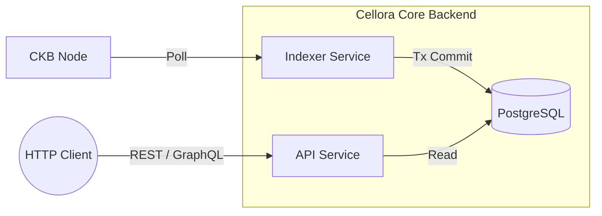

# Cellora

A high-performance, production-grade, multi-tenant SaaS indexer for the [Nervos CKB](https://www.nervos.org) blockchain. Cellora exposes indexed on-chain data—including blocks, transactions, and cells—via REST and GraphQL APIs, empowering DApp teams to query the CKB network efficiently without maintaining their own indexing infrastructure.

## Architecture

Cellora is engineered for maximum throughput and reliability, leveraging a Rust-based asynchronous poller, a robust PostgreSQL relational store, and secure API delivery.



### Core Components

- **`crates/common`**: Handles cross-cutting concerns including shared configuration, structured logging, and the CKB JSON-RPC client.
- **`crates/db`**: Provides SQLx-backed repositories for persisting blocks, transactions, cells, and safely managing indexer checkpoints.
- **`crates/indexer`**: The high-performance service binary that operates the polling loop, handles chain reorganizations, and reliably writes state to Postgres.
- **`crates/api`**: The REST and GraphQL service binary. It serves indexed data to clients over HTTP, featuring intelligent rate limiting and token-bucket traffic control.

For deep technical insights, review the [Architecture Overview](./docs/architecture-overview.md).

## Prerequisites

- Rust **stable** (pinned via `rust-toolchain.toml`)
- Docker & Docker Compose (v2)
- `sqlx-cli` (automatically installed via development scripts)

## Quickstart

Start the local stack and indexer in just a few steps.

1. **Configure your environment**
   ```bash
   cp .env.example .env
   ```

2. **Boot infrastructure dependencies**
   Start PostgreSQL, Redis, and the CKB dev node:
   ```bash
   scripts/dev-up.sh
   ```

3. **Start the Indexer Service**
   Run the block poller to begin ingesting the chain:
   ```bash
   cargo run -p cellora-indexer
   ```

4. **Start the API Server**
   In a new terminal window, start serving traffic:
   ```bash
   cargo run -p cellora-api
   ```

### Authenticating with the API

The API binds to `0.0.0.0:8080`. While endpoints like `/v1/health` and the OpenAPI schema are public, data queries require a Bearer token.

Generate a secure API key using the integrated admin CLI:

```bash
cargo run -p cellora-api -- admin create-key --tier free --label "local-dev"
export CELLORA_API_KEY="your-generated-key-here"
```

## Making Requests

You can query the blockchain using standard REST or flexible GraphQL.

**Authenticated REST:**
```bash
# Get the latest indexed block
curl -s -H "authorization: Bearer $CELLORA_API_KEY" \
  http://localhost:8080/v1/blocks/latest | jq

# Search for cells by lock_hash
curl -s -H "authorization: Bearer $CELLORA_API_KEY" \
  "http://localhost:8080/v1/cells?lock_hash=0x$(printf 'aa%.0s' {1..32})" | jq
```

**Authenticated GraphQL:**
```bash
curl -s -X POST http://localhost:8080/graphql \
  -H "authorization: Bearer $CELLORA_API_KEY" \
  -H "content-type: application/json" \
  -d '{"query":"{ blocksLatest { number hash } stats { lagBlocks } }"}' | jq
```

Full API specs can be found in our [API Documentation](./docs/api.md) or the locally hosted OpenAPI specification at `/v1/openapi.json`.

## Configuration & Tuning

Cellora uses standard `12-factor` environment variable configuration. 

Key tunable parameters include:
- `CELLORA_POLL_INTERVAL_MS`: Tuning for node block polling speed.
- `CELLORA_API_MAX_PAGE_SIZE`: Hard limits for API clients.
- `CELLORA_API_RATE_LIMIT_*`: Granular token-bucket rate limits per tier for both REST and GraphQL surfaces.

See `.env.example` for all configurable environment options.

## Testing Strategy

Cellora maintains comprehensive test coverage across four primary layers:

```bash
# 1. Pure unit tests (fast, CI-safe)
cargo test -p cellora-indexer --test parser_test

# 2. Database integration (requires Docker)
cargo test -p cellora-db --test db_integration

# 3. Indexer End-to-End stack (with Wiremock CKB node)
cargo test -p cellora-indexer --test indexer_stack_test

# 4. API End-to-End router tests (REST, GraphQL, Auth, Rate Limits)
cargo test -p cellora-api

# Run the entire test suite:
cargo test --workspace
```

## License

Cellora is licensed under the [Functional Source License, Version 1.1, with Apache 2.0 future grant](./LICENSE.md) (**FSL-1.1-ALv2**).
